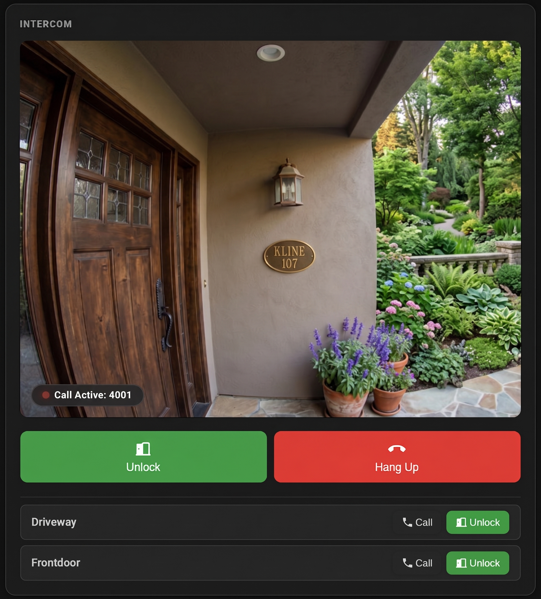

# Hager TJA470 Intercom — Home Assistant Integration

> **Disclaimer:** This is an unofficial, community-developed integration. It is not affiliated with, endorsed by, or supported by Hager Group in any way. Use at your own risk.

A custom integration for the **Hager TJA470 IP intercom** that brings live video, door control, and call handling directly into Home Assistant.



## Features

- **Live camera stream** — the intercom's video feed appears as a standard HA camera entity
- **Door release buttons** — one button per connected door station, plus an "Open Active Door" button that releases whichever door is currently on screen
- **Camera switching** — cycle through connected door stations
- **Call state tracking** — the camera entity reflects the current call state (`idle`, `ringing`, `dialing`, `answered`) and the caller ID
- **SIP call control** — answer, decline, hang up, or initiate outgoing calls via HA services
- **Push notifications** — incoming calls trigger a push notification to configured Home Assistant companion app devices
- **Dedicated dashboard panel** — an "Intercom" entry appears in the HA sidebar with a purpose-built card showing the live feed, call controls, and door release buttons for all stations
- **Custom Lovelace card** — `tja470-intercom-card` can be added to any dashboard

## Prerequisites

### TJA470 web interface — create a local user with a free device slot

The TJA470 authenticates connected clients using named local users, each of which has pairing slots for mobile devices. Before setting up the integration you need a local user with at least one free slot:

1. Open the TJA470 web interface (browse to the intercom's IP address)
2. Log in with your administrator credentials
3. Create a local user (or use an existing one) — this is the user the integration will authenticate as
4. Ensure that user has at least one free device slot; if all slots are occupied, delete one to free it up

The integration will claim that slot during setup and store the pairing credentials automatically.

## Installation

### Via HACS (recommended)

1. Open HACS in Home Assistant
2. Go to **Integrations** and click the menu in the top-right corner → **Custom repositories**
3. Add this repository URL and select category **Integration**
4. Search for "Hager TJA470 Intercom" and install it
5. Restart Home Assistant

### Manual

Copy the `custom_components/tja470_intercom` directory into your HA `config/custom_components/` folder and restart.

## Setup

1. Go to **Settings → Integrations → Add Integration**
2. Search for **Hager TJA470 Intercom**
3. Enter the intercom's IP address and the credentials of the local user you created
4. Select a free device slot to pair with — the integration registers itself as a mobile client using that slot
5. Click **Submit** — HA will create all entities and the sidebar panel immediately

### Installation parameters

| Parameter | Description |
| :--- | :--- |
| **IP Address or Hostname** | The local IP address or hostname of the TJA470 (e.g. `192.168.1.50`) |
| **Username** | Username of the local TJA470 user created for this integration |
| **Password** | Password of that local user |

## Entities

| Entity | Type | Description |
| :--- | :--- | :--- |
| `camera.tja470_intercom_…_camera` | Camera | Live MJPEG/RTSP stream |
| `button.tja470_intercom_…_open_active_door` | Button | Release the currently active door |
| `button.tja470_intercom_…_switch_camera` | Button | Cycle to the next camera position |
| `button.<door_name>_open` | Button | Release a specific door station (one per station) |
| `sensor.…_sip_registrar` | Sensor (diagnostic) | IP address used as SIP registrar |
| `sensor.…_rtsp_stream_url` | Sensor (diagnostic) | Full RTSP stream URL |
| `sensor.…_sip_registration_status` | Sensor (diagnostic) | SIP registration state |

## Services

| Service | Description |
| :--- | :--- |
| `tja470_intercom.open_door` | Release a door by ID |
| `tja470_intercom.open_door_at_position` | Switch camera to a position index and release the door |
| `tja470_intercom.switch_camera` | Cycle to the next camera, or jump to a specific position |
| `tja470_intercom.answer_call` | Answer the current incoming call |
| `tja470_intercom.hangup_call` | Hang up or decline the current call |
| `tja470_intercom.initiate_call` | Dial a SIP extension (e.g. a door station) |
| `tja470_intercom.get_sip_credentials` | Return SIP credentials for use in an external SIP client |
| `tja470_intercom.trigger_incoming_ring` | Simulate an incoming call (testing/automation development) |

## Push notifications

You can configure the integration to send a push notification to one or more Home Assistant companion app devices whenever the doorbell rings:

1. Go to **Settings → Integrations → Hager TJA470 Intercom → Configure**
2. Select the mobile devices to notify — the list is auto-populated from installed companion apps and sorted by most recently seen

### Configuration parameters

| Parameter | Description |
| :--- | :--- |
| **Devices to notify** | One or more HA companion app devices that receive a push notification on incoming calls |

## Lovelace card

The card is registered automatically. To add it to a dashboard manually:

```yaml
type: custom:tja470-intercom-card
```

Optional configuration:

```yaml
type: custom:tja470-intercom-card
name: Front Door          # Override the title (default: entity friendly name)
aspect_ratio: "16 / 9"   # Override the video feed aspect ratio (default: 4 / 3)
door_buttons:             # Manually specify extra door stations
  - entity: button.front_gate_open
    name: Front Gate
  - entity: button.back_door_open
    name: Back Door
    sip_id: "4001"        # Enable a "Call" button for this station
```

If `door_buttons` is not set the card auto-discovers connected door stations from the entity registry.

## Removal

1. Go to **Settings → Integrations**, find **Hager TJA470 Intercom**, click the three-dot menu → **Delete**
2. Restart Home Assistant
3. If you installed via HACS: open HACS → Integrations, find the integration, and click **Remove**
   If you installed manually: delete the `custom_components/tja470_intercom` folder from your HA config directory
